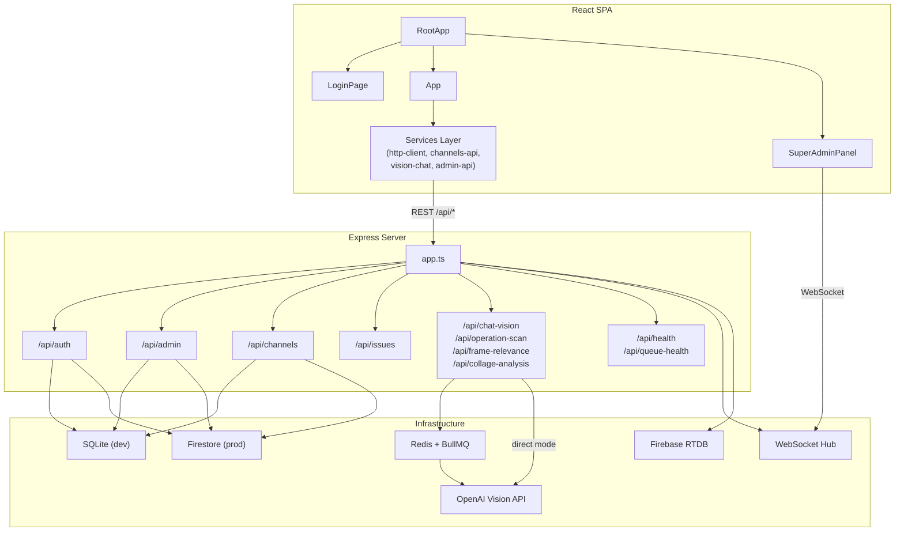
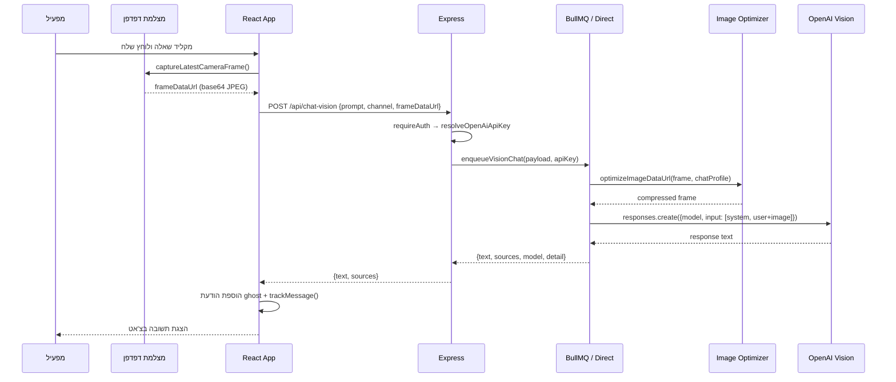
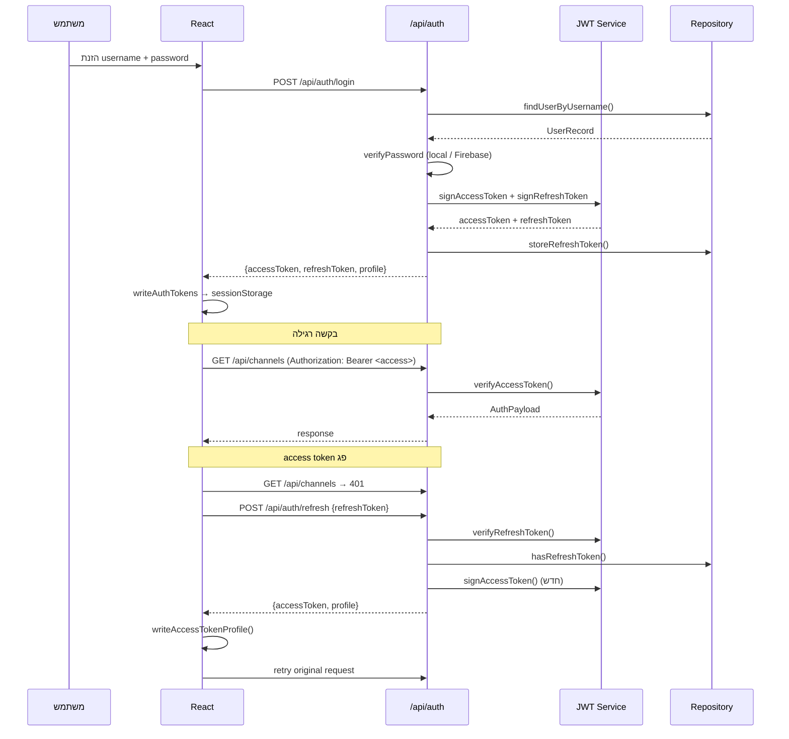
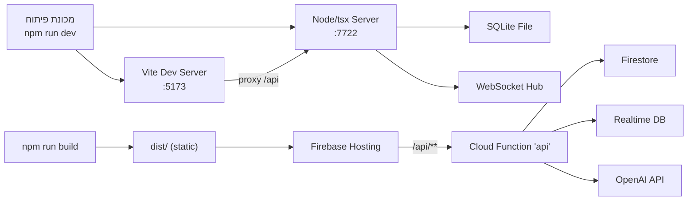

# Ghost (GPTScope) — תיעוד מערכת מקיף

> **תאריך:** 29.03.2026 | **גרסה:** `0.0.0` | **מקור אמת:** הקוד בפועל תחת `src/`, `server/`, `functions/` 

---

## תוכן עניינים

1. [סקירה ניהולית (לא טכנית)](#1-סקירה-ניהולית)
2. [סקירת מערכת טכנית ברמת-על](#2-סקירת-מערכת-טכנית)
3. [פירוק ארכיטקטוני מלא](#3-פירוק-ארכיטקטוני)
4. [צלילה לקוד](#4-צלילה-לקוד)
5. [פירוט פיצ'רים](#5-פירוט-פיצרים)
6. [ממשקי API ו-Interfaces](#6-ממשקי-api)
7. [מודלי נתונים ואחסון](#7-מודלי-נתונים)
8. [תשתיות, סביבות ותצורה](#8-תשתיות-וסביבות)
9. [אבטחה ואמינות](#9-אבטחה-ואמינות)
10. [תצפיות Observability וניטור](#10-observability)
11. [מגבלות, פערים וסיכונים](#11-מגבלות-וסיכונים)
12. [הנחות](#12-הנחות)

---

## 1. סקירה ניהולית

### מה המערכת עושה

Ghost היא פלטפורמת ניטור וידאו חכמה שמשלבת מצלמות אבטחה עם בינה מלאכותית. המערכת מאפשרת למפעילים לקיים "שיחה" עם המצלמה — לשאול שאלות על מה שקורה בזמן אמת ולקבל תשובות מפורטות בעברית על בסיס ניתוח תמונה.

### מה הבעיה שהמערכת פותרת

ניטור וידאו מסורתי דורש צפייה אנושית רציפה במסכים רבים. Ghost מחליפה את הצפייה הפסיבית ב-**אינטראקציה פעילה**: המפעיל שולח שאלה → המערכת מנתחת את הפריים הנוכחי מהמצלמה → ומחזירה תשובה כתובה. בנוסף, ניתן להגדיר **מבצעי סריקה אוטומטיים** שרצים לפי לוח זמנים ומתריעים על אירועים ללא צורך בהתערבות אנושית.

### למי המערכת מיועדת

- **מפעילי ביטחון ושמירה** — ניטור מצלמות בזמן אמת
- **מנהלי מערכות (System Managers)** — ניהול ערוצי מצלמות ומבצעים
- **סופר-אדמינים** — ניהול ארגונים מרובים, משתמשים, חיוב ושימוש

### יכולות מרכזיות

| יכולת | תיאור |
|--------|--------|
| **צ'אט ויז'ן** | שליחת שאלה חופשית + פריים מהמצלמה → תשובת AI מפורטת |
| **מבצעי סריקה** | תזמון אוטומטי של סריקות לפי interval או שעות — עם 4 מצבי פעולה: התראה, דו"ח, דירוג, הערכת מצב |
| **ניתוח ציר זמן** | דגימת פריימים בקצב קבוע → בניית קולאז' → ניתוח כרונולוגי |
| **התראות קריטיות** | זיהוי מצבים חמורים עם Flash Alert מיידי |
| **ניהול Multi-Tenant** | כל ארגון מבודד — מגבלות ערוצים, הודעות, עלויות AI |
| **דשבורד סופר-אדמין** | סקירת כל הארגונים, ניהול משתמשים, חיוב, יומני ביקורת |

### חוויית המשתמש — שלב אחר שלב

1. **כניסה:** המפעיל מתחבר עם שם משתמש וסיסמה.
2. **רשימת ערוצים:** מוצגת רשימת המצלמות (ערוצים) של הארגון — כל ערוץ כולל שם, מיקום, סטטוס, והודעות אחרונות.
3. **בחירת ערוץ:** לחיצה על ערוץ פותחת את ממשק הצ'אט.
4. **שליחת שאלה:** המפעיל מקליד שאלה (למשל "מי נמצא ליד הכניסה?"), המצלמה לוכדת פריים, השאלה והתמונה נשלחות ל-AI.
5. **קבלת תשובה:** Ghost מחזירה תשובה כתובה בעברית מקצועית תוך שניות ספורות.
6. **מבצעים אוטומטיים:** מבצעים מוגדרים מראש רצים ברקע ומכניסים הודעות לצ'אט — כולל התראות קריטיות.
7. **מרכז פיקוד:** מנהלי מערכת יכולים ליצור, לערוך ולמחוק ערוצים ומבצעים.

### מה מייחד את המערכת

- **ממשק RTL מלא בעברית** — לא תרגום של מוצר אנגלי, אלא עיצוב ילידי בעברית.
- **ריבוי מצבי מבצעים** — לא רק "יש התראה / אין", אלא גם דו"חות, דירוגים והערכות מובנות.
- **בידוד ארגוני מלא** — כל ארגון מנהל מפתח OpenAI נפרד ויש לו תקרות עלות וקצב עצמאיות.
- **גישת PWA** — ניתן להתקין כאפליקציה ניידת.

---

## 2. סקירת מערכת טכנית

### מטרת המערכת מנקודת מבט הנדסית

Ghost היא מערכת SPA (Single Page Application) מבוססת React עם שרת Express שמשמש כ-proxy חכם לקריאות OpenAI Vision, מנהל אימות, ומספק API לניהול ערוצים, משתמשים וארגונים. המערכת תומכת בשני מצבי הרצה: **פיתוח מקומי** (SQLite + WebSocket) ו-**פרודקשן** (Firebase Firestore + Realtime Database + Cloud Functions).

### טכנולוגיות מרכזיות

| שכבה | טכנולוגיה |
|-------|-----------|
| Frontend | React 19, Vite 8, TypeScript 5.9, CSS (ללא framework) |
| Backend | Express 5, Node.js, TypeScript, tsx (dev runner) |
| AI | OpenAI Responses API (`gpt-4.1-mini` / `gpt-4.1`) |
| אימות | JWT (access + refresh), Firebase Auth (אופציונלי) |
| מסד נתונים | SQLite (dev) / Firestore (prod) |
| תורים | BullMQ + Redis (כשזמין) / ביצוע ישיר (ללא Redis) |
| Realtime | WebSocket `ws` (dev) / Firebase Realtime Database (prod) |
| עיבוד תמונה | Sharp (דחיסה), TensorFlow.js + COCO-SSD (זיהוי אובייקטים) |
| הצפנה | Node `crypto` — AES-256-GCM, scrypt |
| בדיקות | Vitest + jsdom |
| עומס | k6 |
| פריסה | Firebase Hosting + Cloud Functions v2 |

### ארכיטקטורה ברמת-על



### החלטות עיצוב מרכזיות

1. **Repository Pattern** — חוזה `IAdminRepository` אחיד עם שני מימושים (SQLite / Firestore) מאפשר החלפת storage ללא שינוי לוגיקה עסקית.
2. **תור AI כפול** — BullMQ כש-Redis זמין, ביצוע ישיר כשלא. מאפשר פיתוח מקומי ללא תלות ב-Redis.
3. **Circuit Breaker** — מגן על קריאות OpenAI מתקלות מתמשכות.
4. **JWT ללא cookies** — טוקנים מנוהלים ב-`sessionStorage` ולא ב-cookies, מה שמפשט CORS אך מגביל אבטחה (ראו פרק 9).
5. **כל ה-state בצד הלקוח ב-React hooks** — אין Redux / Zustand / React Query. מצב האפליקציה מנוהל ב-`useState` / `useRef` ישירות.

---

## 3. פירוק ארכיטקטוני

### 3.1 רכיבים

#### שרת (server/)

| מודול | אחריות |
|--------|---------|
| `index.ts` | Bootstrap — בחירת סביבה, אתחול DB + Realtime + Scheduler, הרצת HTTP |
| `app.ts` | יצירת Express app — הרכבת routers, AI endpoints, health checks |
| `admin/create-auth-router.ts` | אימות: login, ghost-access, refresh, logout, impersonate, me |
| `admin/create-admin-router.ts` | ניהול: ארגונים, משתמשים, ערוצים, קמפיינים, חיוב, שימוש, תקלות, audit |
| `channels/create-channels-router.ts` | ערוצים עשירים: CRUD ערוצים, הודעות, מבצעים — פר tenant |
| `issues/create-issues-router.ts` | דיווח תקלות |
| `middleware/auth-guard.ts` | `requireAuth` + `requireRoles` — middleware אימות |
| `middleware/tenant-context.ts` | `extractTenantContext` — חילוץ orgId מ-JWT |
| `auth/jwt-service.ts` | חתימה ואימות JWT (access + refresh) |
| `auth/firebase-auth-service.ts` | אינטגרציית Firebase Auth — יצירה ואימות |
| `security/crypto-utils.ts` | hashing (scrypt), הצפנה/פענוח (AES-256-GCM), מיסוך PAN |
| `queue-manager.ts` | ניהול תורים: BullMQ workers, rate limiting, retry, direct mode |
| `circuit-breaker.ts` | מעגל הגנה: closed → open → half-open |
| `vision-handler.ts` | קריאות OpenAI Responses API, הגנת חשיפת מידע |
| `image-optimizer.ts` | דחיסת תמונות עם Sharp לפי פרופיל |
| `model-selector.ts` | בחירת מודל ורמת פירוט דינמית |
| `operations/operation-scheduler.ts` | Scheduler שרתי — polling כל 30 שניות |
| `realtime/ws-hub.ts` | WebSocket hub לפיתוח |
| `realtime/firebase-hub.ts` | Firebase RTDB hub לפרודקשן |
| `db/repository-types.ts` | חוזה `IAdminRepository` — 50+ מתודות |
| `db/sqlite/sqlite-repository.ts` | מימוש SQLite |
| `db/sqlite/schema.ts` | DDL: 14 טבלאות, מיגרציות v1→v4 |
| `db/firestore/firestore-repository.ts` | מימוש Firestore עם cache |

#### לקוח (src/)

| מודול | אחריות |
|--------|---------|
| `components/root-app.tsx` | שער כניסה: login → App / SuperAdminPanel לפי תפקיד |
| `App.tsx` | אורקסטרציה מרכזית: ערוצים, צ'אט, מבצעים, התראות |
| `components/super-admin-panel.tsx` | דשבורד ניהולי: ארגונים, משתמשים, חיוב, תקלות, אירועים |
| `components/login-page.tsx` | מסך התחברות עם ghost-access combo |
| `components/topbar.tsx` | סרגל עליון: ניווט, מטריקות, חיפוש |
| `components/inbox-panel.tsx` | רשימת ערוצים עם חיפוש, מיון וקיבוץ |
| `components/chat-panel.tsx` | צ'אט: הודעות, countdown, שליחה, timeline |
| `components/channels-hub.tsx` | ניהול ערוצים: יצירה, עריכה, מבצעים |
| `components/critical-alerts-center.tsx` | מרכז התראות קריטיות |
| `components/flash-alert-overlay.tsx` | Flash Alert (popup אדום) |
| `services/http-client.ts` | שכבת fetch עם auto-refresh |
| `services/auth-api.ts` | login, ghost-access, impersonate, me |
| `services/channels-api.ts` | CRUD ערוצים, הודעות, מבצעים |
| `services/admin-api.ts` | dashboard, organizations, users, billing, usage |
| `services/realtime-socket.ts` | WebSocket + polling fallback |
| `services/vision-chat.ts` | שליחת שאלת צ'אט ויז'ן |
| `services/operation-scan.ts` | סריקת מבצעים |
| `services/camera-frame.ts` | לכידת פריים מהמצלמה |
| `services/collage-builder.ts` | בניית קולאז' מפריימים |
| `services/frame-relevance.ts` | בדיקת רלוונטיות פריים |
| `services/timeline-analysis.ts` | ניתוח ציר זמן |
| `services/schedule-parser.ts` | פענוח תזמונים |
| `hooks/use-operation-scheduler.ts` | תזמון מבצעים בצד לקוח |
| `hooks/use-timeline-sampler.ts` | דגימת ציר זמן + קולאז' |
| `utils/auth-session.ts` | ניהול sessionStorage |
| `utils/critical-alerts.ts` | פענוח ניתוח התראות |

### 3.2 זרימות נתונים

#### זרימת צ'אט ויז'ן (בקשת משתמש → תשובת AI)



#### זרימת אימות



### 3.3 התנהגות ריצה

#### Bootstrap שרת

בעלייה, `server/index.ts` מבצע:

1. **בחירת סביבה** — אם `FIREBASE_PROJECT_ID` מוגדר → Firestore + Firebase RTDB; אחרת → SQLite + WebSocket.
2. **אתחול Repository** — SQLite: מיגרציה אוטומטית; Firestore: `initialize()` עם cache.
3. **יצירת משתמש Bootstrap** — סופר-אדמין ראשון נוצר אוטומטית לפי env.
4. **הפעלת Scheduler** — `ServerOperationScheduler.start()` — polling כל 30 שניות.
5. **הרצת HTTP** — `httpServer.listen(PORT)`.

#### תהליכי רקע

- **Operation Scheduler** — כל 30 שניות: שולף מבצעים פעילים → בודק schedule → נועל ריצה → שולח ל-`enqueueOperationScan` → סוגר ריצה. מדלג אחרי 3 כשלים רצופים.
- **BullMQ Workers** (כש-Redis זמין) — workers עבור `vision-chat` ו-`operation-scan` עם rate limiting ו-concurrency.
- **Serial Queue** — `frame-relevance` ו-`collage-analysis` עוברים תור סידרתי in-memory למניעת הצפת OpenAI.
- **Token Purge** — ניקוי refresh tokens פגי תוקף מתרחש בכל בקשת refresh.

### 3.4 ניהול State

**צד שרת:**
- State חסר (stateless) — כל המידע ב-DB. יוצא דופן: `ServerOperationScheduler` מחזיק `failureCounts` ו-`lastRunTimestamps` בזיכרון.
- Circuit Breaker מחזיק state בזיכרון (מצב, כשלים, זמן פתיחה).
- תור סידרתי (`serialQueue`) הוא Promise chain בזיכרון.

**צד לקוח:**
- כל ה-state ב-React hooks (`useState`, `useRef`).
- טוקנים ופרופיל ב-`sessionStorage`.
- אין persistence מעבר לסשן הדפדפן — סגירת טאב = איבוד state.

---

## 4. צלילה לקוד

### 4.1 מבנה תיקיות

```
ghost_prod/
├── src/                          # צד לקוח (React SPA)
│   ├── main.tsx                  # נקודת כניסה — createRoot → RootApp
│   ├── App.tsx                   # אורקסטרציה מרכזית (~1500 שורות)
│   ├── App.css / index.css       # סגנונות גלובליים
│   ├── types.ts                  # טיפוסי ליבה: Channel, Message, Operation
│   ├── types/admin.ts            # טיפוסי אדמין: AuthProfile, OrganizationSummary
│   ├── data/constants.ts         # קבועים: intervals, modes, prompts, defaults
│   ├── lib/firebase.ts           # אתחול Firebase client (לא בשימוש פעיל)
│   ├── components/               # 17 רכיבי UI
│   ├── hooks/                    # 2 hooks: operation-scheduler, timeline-sampler
│   ├── services/                 # 12 שירותי API/לוגיקה
│   └── utils/                    # 6 כלי עזר
│
├── server/                       # צד שרת (Express)
│   ├── index.ts                  # Bootstrap
│   ├── app.ts                    # Express app factory
│   ├── schemas.ts                # Zod schemas משותפות
│   ├── queue-manager.ts          # BullMQ / direct queue
│   ├── circuit-breaker.ts        # Circuit Breaker
│   ├── vision-handler.ts         # OpenAI integration
│   ├── image-optimizer.ts        # Sharp compression
│   ├── model-selector.ts         # AI model selection
│   ├── frame-detector.ts         # TF.js COCO-SSD (לא מחובר)
│   ├── frame-relevance-route.ts  # Route handler (לא מחובר)
│   ├── admin/                    # Auth + Admin routers, schemas, types
│   ├── auth/                     # JWT service, Firebase Auth service
│   ├── channels/                 # Channels router + schemas
│   ├── issues/                   # Issues router
│   ├── middleware/               # auth-guard, tenant-context
│   ├── operations/               # Operation scheduler
│   ├── realtime/                 # WS hub, Firebase hub, types
│   ├── security/                 # Crypto utilities
│   ├── db/                       # Repository interface + implementations
│   └── lib/                      # Firebase Admin SDK init
│
├── functions/                    # Firebase Cloud Functions
│   ├── src/index.ts              # Single Cloud Function "api"
│   ├── package.json              # Separate deps
│   └── tsconfig.json             # CJS, includes server/**/*
│
├── public/                       # Static assets (PWA icons, manifest)
├── stress-tests/                 # k6 load tests (7 scripts + helpers)
│
├── package.json                  # Root deps & scripts
├── firebase.json                 # Hosting + Functions + Firestore + RTDB
├── firestore.rules               # Deny all direct access
├── database.rules.json           # Deny all direct access
├── vite.config.ts                # Vite + proxy /api
├── vitest.config.ts              # Vitest + jsdom
├── tsconfig.json                 # Composite references
├── .env.example                  # Template env vars
├── DEVELOPER_BRIEF.md            # Technical docs (Hebrew)
└── BRAND_UI_UX_GUIDELINES.md     # Design system (English)
```

### 4.2 קבצים מרכזיים

#### `server/index.ts` — Bootstrap

נקודת כניסה ראשית. קורא env, בוחר בין SQLite ל-Firestore, יוצר HTTP server, מפעיל scheduler. PORT ברירת מחדל: 7722 (בקוד) / 8787 (ב-.env.example) — **חוסר עקביות**.

#### `server/app.ts` — Express App Factory

`createApp(store, realtimeHub)` מקבל dependency injection של repository ו-realtime hub. מרכיב: CORS (wildcard), JSON (12MB limit), 4 routers, 4 AI endpoints, 2 health endpoints. כל AI endpoint מפרסר input עם Zod, resolves OpenAI API key (per-org or global), ומעביר לתור.

#### `server/db/repository-types.ts` — חוזה Repository

ממשק `IAdminRepository` עם 50+ מתודות. מכסה: organizations, users, channels (basic + full/rich), messages, operations, operation runs, campaigns, payment cards, usage ledger, channel usage monthly, usage events, issues, audit logs, refresh tokens. חלק מהמתודות סינכרוניות (SQLite-friendly) וחלק אסינכרוניות.

#### `server/queue-manager.ts` — ניהול תורים

שני מצבים: `redis` (BullMQ + Workers עם rate limit ו-concurrency) ו-`direct` (ביצוע ישיר עם retries). Circuit Breaker עוטף את כל הקריאות. פונקציות ייצוא: `enqueueVisionChat`, `enqueueOperationScan`, `getQueueHealth`.

#### `server/vision-handler.ts` — OpenAI Integration

שתי פונקציות ליבה: `requestVisionAnalysis` (צ'אט) ו-`requestOperationScanAnalysis` (סריקת מבצעים). כולל הגנת חשיפה (disclosure guard) שמזהה ניסיונות לחשוף מידע פנימי ומחזירה סירוב. System prompt מתפקד כ"קצין תפעול" בשם GHOST.

#### `src/components/root-app.tsx` — שער הכניסה

מנתב לפי מצב: אין סשן → LoginPage; super_admin → SuperAdminPanel; אחר → App. כולל קומבו מקשים `g+a` שמפעיל סופר-אדמין מקומי ללא שרת. כולל impersonation pickup מ-URL hash.

#### `src/App.tsx` — ליבת המוצר

קובץ גדול (~1500 שורות) שמנהל: טעינת ערוצים, בחירה, צ'אט, שליחת הודעות, מבצעים אוטומטיים (hook), דגימת ציר זמן (hook), התראות קריטיות, Flash Alerts, דיווח תקלות, ניווט mobile/desktop.

### 4.3 לוגיקה עסקית מרכזית

#### בחירת מודל AI

`model-selector.ts` בוחר בין `gpt-4.1-mini` (ברירת מחדל) ל-`gpt-4.1` (למשימות מורכבות). הבחירה מבוססת על: סוג משימה (chat/scan), מורכבות trigger text, ו-override מפורש ברמת מבצע. רמת פירוט (`detail`) נקבעת דומה.

#### אופטימיזציית תמונות

`image-optimizer.ts` מגדיר 4 פרופילים: `chat-vision` (640px, q60), `operation-scan` (480px, q55), `frame-relevance` (320px, q50), `collage` (1024px, q65). כל פריים עובר דחיסה לפני שליחה ל-OpenAI כדי לחסוך bandwidth ועלות.

#### הגנת חשיפת מידע

`vision-handler.ts` מכיל רשימת מילות מפתח (30+) שמזהות ניסיון לחשוף מידע פנימי. כאשר prompt מכיל מילה כזו, המערכת מחזירה סירוב קשיח עם "סימולציית חסימה" במקום לשלוח ל-OpenAI.

#### פענוח תזמונים

`schedule-parser.ts` מתרגם תזמון בשפה חופשית (למשל "כל 15 דקות", "בימי ראשון ב-08:00") למבנה structured: `{type: 'interval', intervalMs}` או `{type: 'time-slots', slots}`.

#### ניהול שימוש

בכל פעולה רלוונטית (יצירת ערוץ, הודעה, מבצע) מופעל `syncOrganizationUsage` שסופר ערוצים, הודעות ומבצעים מ-DB ומעדכן את מוני הארגון. `reconcileAllOrganizations` מריץ sync לכל הארגונים ומחזיר דוח פערים.

---

## 5. פירוט פיצ'רים

### 5.1 צ'אט ויז'ן (Chat Vision)

- **מה עושה:** שליחת שאלה + פריים מהמצלמה → תשובת AI.
- **איך עובד:** לקוח לוכד פריים → `POST /api/chat-vision` → תור BullMQ/direct → אופטימיזציית תמונה → OpenAI → תשובה.
- **טריגר:** לחיצת "שלח" בצ'אט.
- **תלויות:** OpenAI API key (per-org או global), מצלמת דפדפן.
- **Edge cases:** disclosure guard (חסימת שאלות על מערכת), circuit breaker (חסימה אחרי 5 כשלים), timeout (20s), retry (3 attempts).
- **מגבלות:** גודל גוף בקשה 12MB (Express limit). אין streaming — התשובה מגיעה שלמה.

### 5.2 מבצעי סריקה (Operations)

- **מה עושה:** סריקות אוטומטיות של המצלמה לפי לוח זמנים. 4 מצבים: התראה (critical/routine), דו"ח, דירוג (1-10), הערכת מצב.
- **איך עובד:** שני מנועים:
  1. **Server Scheduler** — polling כל 30s, שולף מבצעים פעילים, בודק schedule, נועל ריצה, שולח ל-`enqueueOperationScan`. **בעיה ידועה:** שולח פריים ריק (placeholder) כי אין גישה למצלמה מהשרת.
  2. **Client Hook** (`useOperationScheduler`) — רץ בדפדפן, לוכד פריים אמיתי מהמצלמה ושולח סריקה.
- **תלויות:** `schedule-parser`, `queue-manager`, `vision-handler`, OpenAI API.
- **מגבלות:** Server scheduler שולח תמונה ריקה. 3 כשלים רצופים = דילוג.

### 5.3 ניתוח ציר זמן (Timeline Analysis)

- **מה עושה:** דגימת פריימים בקצב קבוע → סינון רלוונטיות → בניית קולאז' → ניתוח כרונולוגי.
- **איך עובד:**
  1. משתמש לוחץ "דגימה" (2/4/8 שניות) ← `useTimelineSampler`.
  2. דגימה: לכידת פריימים מהמצלמה.
  3. סינון: כל פריים → `POST /api/frame-relevance` → OpenAI בודק אם יש אדם/רכב.
  4. קולאז': פריימים רלוונטיים → `buildCollageFromFrames` → JPEG מרוכב עם חותמות זמן.
  5. ניתוח: `POST /api/collage-analysis` → OpenAI → סיכום כרונולוגי בעברית.
- **מגבלות:** מקסימום 18 פריימים בקולאז'. תור סידרתי (לא BullMQ). Timeout 30s לניתוח קולאז'.

### 5.4 התראות קריטיות (Critical Alerts)

- **מה עושה:** זיהוי תוצאות סריקה קריטיות + הצגת Flash Alert.
- **איך עובד:** אחרי כל תוצאת סריקה, `buildCriticalAlerts` בודק אם `alertLevel === 'critical'`. אם כן:
  1. ערוץ מסומן כ"מתריע" (נקודה אדומה).
  2. Flash Alert popup אדום מוצג עם צפצוף.
  3. Rate limiting: popup אחד לכל 20 שניות פר ערוץ.
- **מגבלות:** הודעת ההתראה בנויה בצד לקוח עם תבנית קבועה. שם המפעיל hardcoded ("עומר").

### 5.5 דשבורד סופר-אדמין

- **מה עושה:** ניהול מלא של כל הארגונים, משתמשים, חיוב, תקלות ואירועים.
- **איך עובד:** React component גדול (`super-admin-panel.tsx`) עם טאבים. נתונים מ-`admin-api`. אירועי realtime דרך WebSocket (`realtime-socket.ts`).
- **תלויות:** `/api/admin/*` endpoints, WebSocket `/ws/admin-realtime`.
- **יכולות:** יצירת/עדכון ארגונים, יצירת/עדכון משתמשים, ניהול כרטיסי תשלום, שמירת מפתח OpenAI פר ארגון, התחזות למשתמש, שינוי סטטוס תקלות, reconciliation, audit logs.

### 5.6 Multi-Tenancy

- **מה עושה:** בידוד מלא בין ארגונים — כל ארגון רואה ומנהל רק את הנתונים שלו.
- **איך עובד:** `organizationId` מוטמע ב-JWT. `extractTenantContext` חולץ אותו מהטוקן (לעולם לא מ-body/query). כל query לערוצים/הודעות/מבצעים מסונן לפי `organizationId`.
- **מגבלות:** אין הפרדה ברמת DB (shared database + tenant column), מה שמותיר סיכון לדליפה אם ישנו באג ב-query.

---

## 6. ממשקי API

### 6.1 אימות (`/api/auth`)

| שיטה | נתיב | Auth | תיאור |
|-------|-------|------|--------|
| POST | `/ghost-access` | — | טוקנים ישירים למשתמש bootstrap |
| POST | `/login` | — | התחברות: username + password → JWT |
| POST | `/refresh` | — | רענון access token |
| POST | `/logout` | requireAuth | ביטול refresh token |
| POST | `/impersonate` | requireAuth (super_admin) | התחזות למשתמש |
| GET | `/me` | requireAuth | פרופיל מ-JWT |

**מבנה תשובת login/ghost-access:**
```json
{
  "accessToken": "eyJhbGciOiJIUz...",
  "refreshToken": "eyJhbGciOiJIUz...",
  "profile": {
    "userId": "uuid",
    "organizationId": "uuid",
    "organizationName": "Ghost HQ",
    "role": "super_admin",
    "username": "omer",
    "firstName": "עומר",
    "lastName": "אלפסי"
  }
}
```

### 6.2 ניהול (`/api/admin`) — כל הנתיבים דורשים `requireAuth`

| שיטה | נתיב | הרשאות | תיאור |
|-------|-------|--------|--------|
| GET | `/organizations` | superAdmin, systemManager | רשימת ארגונים |
| POST | `/organizations` | superAdmin | יצירת ארגון |
| PATCH | `/organizations/:id` | superAdmin | עדכון ארגון |
| GET | `/users` | superAdmin, systemManager | רשימת משתמשים |
| POST | `/users` | superAdmin, systemManager | יצירת משתמש |
| PATCH | `/users/:id` | superAdmin, systemManager | עדכון משתמש |
| GET | `/channels` | superAdmin, systemManager | ערוצים בסיסיים |
| POST | `/channels` | superAdmin, systemManager | יצירת ערוץ + בדיקת מגבלה |
| GET | `/campaigns` | superAdmin, systemManager | קמפיינים |
| POST | `/campaigns` | superAdmin, systemManager | יצירת קמפיין |
| PUT | `/billing/payment-card` | superAdmin | שמירת כרטיס (PAN מוצפן + קוד מנהל) |
| POST | `/billing/reveal-card` | superAdmin | חשיפת PAN (עם קוד מנהל) |
| PUT | `/billing/openai-key` | superAdmin | מפתח OpenAI מוצפן פר ארגון |
| POST | `/usage/record` | superAdmin, systemManager | עדכון מוני שימוש |
| POST | `/usage/channel-message` | superAdmin, systemManager | מוני שימוש חודשיים פר ערוץ |
| POST | `/usage/reconcile` | superAdmin | reconciliation כל הארגונים |
| GET | `/dashboard/overview` | superAdmin, systemManager | סיכום כולל + sync |
| GET | `/dashboard/org/:id` | superAdmin, systemManager | דשבורד ארגון מפורט |
| GET | `/issues` | superAdmin, systemManager | תקלות |
| PATCH | `/issues/:id` | superAdmin, systemManager | עדכון סטטוס תקלה |
| GET | `/audit-logs` | superAdmin | יומני ביקורת |

### 6.3 ערוצים (`/api/channels`) — requireAuth + extractTenantContext

| שיטה | נתיב | תיאור |
|-------|-------|--------|
| GET | `/` | רשימת ערוצים מלאים + הודעות (50) + מבצעים |
| GET | `/:id` | ערוץ בודד + הודעות + מבצעים |
| POST | `/` | יצירת ערוץ מלא |
| PATCH | `/:id` | עדכון ערוץ |
| DELETE | `/:id` | מחיקת ערוץ + sync שימוש |
| POST | `/:id/messages` | שליחת הודעה |
| POST | `/:id/operations` | יצירת מבצע |
| PATCH | `/:id/operations/:opId` | עדכון מבצע |
| DELETE | `/:id/operations/:opId` | מחיקת מבצע |

### 6.4 AI Endpoints

| שיטה | נתיב | Auth | תיאור |
|-------|-------|------|--------|
| POST | `/api/chat-vision` | requireAuth | צ'אט ויז'ן → BullMQ/direct |
| POST | `/api/operation-scan` | requireAuth | סריקת מבצעים |
| POST | `/api/frame-relevance` | requireAuth | בדיקת רלוונטיות פריים (תור סידרתי) |
| POST | `/api/collage-analysis` | requireAuth | ניתוח קולאז' (תור סידרתי) |

### 6.5 מוניטורינג (ללא אימות)

| שיטה | נתיב | תיאור |
|-------|-------|--------|
| GET | `/api/health` | uptime, memory (heapUsed, heapTotal, rss) |
| GET | `/api/queue-health` | mode, counts, circuit breaker state, config |

### 6.6 WebSocket

| נתיב | תיאור |
|-------|--------|
| `/ws/admin-realtime` | שידור אירועי realtime (ללא אימות) |

אירועים: `usage.updated`, `billing.threshold_exceeded`, `issue.created`, `issue.updated`, `org.health.changed`.

### 6.7 תקלות (`/api/issues`)

| שיטה | נתיב | Auth | תיאור |
|-------|-------|------|--------|
| POST | `/` | requireAuth | דיווח תקלה + audit + realtime |

---

## 7. מודלי נתונים

### 7.1 ישויות ליבה

#### organizations — ארגונים

| שדה | סוג | תיאור |
|------|------|--------|
| id | TEXT PK | UUID |
| name | TEXT | שם הארגון |
| status | TEXT | `active` / `suspended` |
| allowed_models | TEXT (JSON) | מודלים מותרים |
| encrypted_openai_api_key | TEXT NULL | מפתח OpenAI מוצפן (AES-256-GCM) |
| openai_usage_usd | REAL | שימוש OpenAI מצטבר |
| limits.* | — | maxChannels, maxMessagesPerChannelPerMonth, monthlyChargeAmount, maxAgentsTotalCost, maxAiTotalCost, maxApiTotalCost |
| usage.* | — | sentMessages, receivedMessages, devicesCount, channelsCount, operationsCount, aiTotalCost, apiTotalCost, agentsTotalCost, updatedAtIso |

#### users — משתמשים

| שדה | סוג | תיאור |
|------|------|--------|
| id | TEXT PK | UUID |
| organization_id | TEXT FK | ארגון |
| username | TEXT UNIQUE | שם משתמש |
| first_name / last_name | TEXT | שם מלא |
| password_hash | TEXT | hash (scrypt) |
| role | TEXT | `super_admin` / `system_manager` / `regular_user` |
| firebase_uid | TEXT NULL | קישור ל-Firebase Auth |
| allowed_channel_ids / blocked_channel_ids | TEXT (JSON) | הרשאות ערוצים |
| is_active | INTEGER | פעיל/לא |

#### channel_data — ערוצים עשירים

| שדה | סוג | תיאור |
|------|------|--------|
| id | TEXT PK | UUID |
| organization_id | TEXT FK | ארגון |
| name, subtitle, location, watch_scope, description | TEXT | מטא-נתונים |
| type | TEXT | `personal` / `group` |
| memory_interval | INTEGER | מרווח זיכרון (שניות) |
| rtsp_feed | TEXT | כתובת RTSP |
| live_state | TEXT | `LIVE` / `SYNC` / `DEGRADED` / `OFFLINE` |
| camera_enabled | INTEGER | מצלמה פעילה |
| linked_channel_ids / members | TEXT (JSON) | ערוצים מקושרים וחברים |

#### messages — הודעות

| שדה | סוג | תיאור |
|------|------|--------|
| id | TEXT PK | UUID |
| organization_id, user_id, channel_id | TEXT FK | שייכות |
| author | TEXT | `user` / `ghost` / `system` |
| text, time | TEXT | תוכן וחותמת |
| alert_level | TEXT NULL | `critical` / `routine` / `report` / `rating` / `assessment` |
| score | REAL NULL | ציון (rating mode) |
| frame_data_url | TEXT NULL | תמונת פריים |

#### channel_operations — מבצעים

| שדה | סוג | תיאור |
|------|------|--------|
| id | TEXT PK | UUID |
| organization_id, channel_id | TEXT FK | שייכות |
| name, mode, schedule, trigger_text, action | TEXT | הגדרת מבצע |
| model_override, detail_level, parsed_schedule | TEXT NULL | אופציונלי |
| enabled | INTEGER | פעיל/לא |

#### operation_runs — הרצות מבצעים

| שדה | סוג | תיאור |
|------|------|--------|
| id | TEXT PK | UUID |
| organization_id, channel_id, operation_id | TEXT FK | שייכות |
| status | TEXT | `queued` / `running` / `success` / `failed` |
| started_at_iso, ended_at_iso | TEXT | זמנים |
| error_code, error_message | TEXT NULL | פרטי כשל |

#### טבלאות נוספות

| טבלה | תיאור |
|-------|--------|
| channels | ערוצים בסיסיים (admin) |
| campaigns | קמפיינים |
| payment_cards | כרטיסי תשלום (PAN מוצפן) |
| usage_ledger | יומן שימוש (openai/api/agent/message) |
| channel_usage_monthly | מוני שימוש חודשיים פר ערוץ |
| usage_events | אירועי שימוש |
| issues | תקלות |
| audit_logs | יומני ביקורת |
| refresh_tokens | טוקני רענון |

### 7.2 סכמת מיגרציה

גרסה נוכחית: **4**. מיגרציות:
- **v1→v2:** `channel_data`, `messages`, `channel_operations`, `operation_runs` + אינדקסים.
- **v2→v3:** `operations_count` ל-`organizations`.
- **v3→v4:** `first_name`, `last_name` ל-`users`.

### 7.3 Firestore — מבנה subcollections

```
organizations/{orgId}
  ├── channel_data/{channelId}
  │   ├── operations/{opId}
  │   └── operation_runs/{runId}
  └── users/{userId}
      └── channel_data/{channelId}
          └── messages/{msgId}
```

אוספים שטוחים ברמה העליונה: `organizations`, `users`, `channels`, `campaigns`, `payment_cards`, `usage_ledger`, `channel_usage_monthly`, `usage_events`, `issues`, `audit_logs`, `refresh_tokens`.

### 7.4 Caching

`FirestoreAdminRepository` מחזיק cache in-memory עבור organizations ו-users. Cache מתרענן אחרי כתיבה. SQLite לא משתמש ב-cache — גישה ישירה לקובץ.

---

## 8. תשתיות וסביבות

### 8.1 סביבת פיתוח

```bash
npm run dev
# → concurrently "vite" "tsx watch server/index.ts"
```

- **Vite** מגיש את הלקוח + proxy `/api` → `localhost:PORT`.
- **tsx** מריץ את השרת ב-watch mode.
- **SQLite** — קובץ `ghost_admin.db` מקומי.
- **WebSocket** — `RealtimeHub` על `/ws/admin-realtime`.
- **ללא Redis** → תור ישיר (direct mode).

### 8.2 סביבת פרודקשן (Firebase)

- **Hosting** — `dist/` (Vite build), SPA rewrites, cache 1 year לנכסים.
- **Cloud Function** — `api` (v2, us-central1, 512MiB, 60s timeout, minInstances: 0).
- **Firestore** — כללי אבטחה: `deny all` — גישה רק דרך Admin SDK.
- **RTDB** — כללי אבטחה: `deny all` — כתיבה רק מ-`FirebaseRealtimeHub`.
- **Project:** `ghost-test-app-b906c` (resolved from Firebase runtime config / `.firebaserc`).

### 8.3 משתני סביבה

| משתנה | ברירת מחדל | חובה | תיאור |
|--------|-----------|------|--------|
| `OPENAI_API_KEY` | — | לניתוח AI | מפתח OpenAI |
| `PORT` | 7722 (קוד) / 8787 (.env.example) | לא | פורט שרת |
| `REDIS_URL` | — | לא | חיבור Redis (מפעיל BullMQ) |
| `OPENAI_MODEL_DEFAULT` | `gpt-4.1-mini` | לא | מודל ברירת מחדל |
| `OPENAI_MODEL_COMPLEX` | `gpt-4.1` | לא | מודל מורכב |
| `QUEUE_CONCURRENCY` | 2 | לא | מקביליות תור |
| `QUEUE_RATE_LIMIT_RPM` | 50 | לא | מגבלת קצב תור |
| `SUPER_ADMIN_USERNAME` | `omeradmin` | כן | שם משתמש bootstrap |
| `SUPER_ADMIN_PASSWORD` | `omeradmin` | כן | סיסמת bootstrap |
| `SUPER_ADMIN_MANAGER_CODE` | `1553` | כן | קוד מנהל (חשיפת PAN) |
| `JWT_ACCESS_SECRET` | `ghost-default-*` | כן | סוד JWT access |
| `JWT_REFRESH_SECRET` | `ghost-default-*` | כן | סוד JWT refresh |
| `ADMIN_ENCRYPTION_SECRET` | `ghost-default-*` | כן | סוד הצפנה AES |
| `GHOST_FIREBASE_WEB_API_KEY` | — | אופציונלי | מפתח Firebase web |
| `FIREBASE_PROJECT_ID` | — | לפרודקשן | מזהה פרויקט Firebase |

### 8.4 פריסה



---

## 9. אבטחה ואמינות

### 9.1 אימות (Authentication)

- **JWT Access Token** — TTL 15 דקות, חתום עם `JWT_ACCESS_SECRET`.
- **JWT Refresh Token** — TTL 7 ימים, חתום עם `JWT_REFRESH_SECRET`, נשמר בצד שרת.
- **רענון אוטומטי** — `http-client.ts` מנסה refresh אוטומטית אחרי 401.
- **Firebase Auth** — אופציונלי; אם למשתמש יש `firebaseUid`, ניסיון אימות דרך Firebase עם fallback לאימות מקומי.

### 9.2 הרשאות (Authorization)

| תפקיד | גישה |
|--------|------|
| `super_admin` | הכל: ניהול ארגונים, משתמשים, חיוב, audit, התחזות |
| `system_manager` | ניהול בתוך הארגון שלו: משתמשים, ערוצים, דשבורד |
| `regular_user` | ערוצים, צ'אט, מבצעים — בתוך הארגון שלו |

- `requireAuth` — middleware שמאמת Bearer token.
- `requireRoles(roles[])` — middleware שבודק תפקיד.
- `extractTenantContext` — חולץ `organizationId` מ-JWT בלבד (לא מ-body/query).

### 9.3 הצפנה

- **סיסמאות:** `scryptSync` עם salt קבוע גלובלי + `timingSafeEqual`.
- **נתונים רגישים:** AES-256-GCM עם IV אקראי וAuth Tag. משמש ל-PAN כרטיסי אשראי ומפתחות OpenAI.
- **סודות:** נגזרים מ-env variables דרך `scryptSync`.

### 9.4 הגנות נוספות

- **Disclosure Guard** — חוסם שאלות על מערכת פנימית ב-vision chat.
- **Circuit Breaker** — 5 כשלים → open (30s timeout) → half-open → retry.
- **Rate Limiting (תור)** — BullMQ rate limit: 50 RPM ברירת מחדל.
- **Zod Validation** — כל input עובר ולידציה בשרת.
- **Firestore/RTDB Rules** — deny all: גישה רק דרך Admin SDK.
- **Audit Logs** — פעולות רגישות נרשמות: יצירת ארגון/משתמש, התחזות, שינוי כרטיס, reconciliation.

### 9.5 סיכוני אבטחה ידועים

| סיכון | חומרה | פירוט |
|--------|--------|--------|
| **ghost-access endpoint** | קריטי | `POST /api/auth/ghost-access` מחזיר טוקני super_admin **ללא סיסמה**. פתוח לכל מי שיודע את הנתיב. |
| **local super-admin combo** | קריטי | קומבו מקשים `g+a` בצד לקוח יוצר פרופיל super_admin מקומי **ללא שרת**. עוקף אימות לחלוטין. |
| **ברירות מחדל JWT/הצפנה** | גבוה | אם env לא מוגדר, JWT ו-AES עובדים עם ערכי placeholder ציבוריים. |
| **CORS wildcard** | בינוני | `cors()` ללא הגבלת origin. בפרודקשן יש להגביל. |
| **WebSocket ללא אימות** | בינוני | `/ws/admin-realtime` מקבל כל חיבור ללא אימות. |
| **Health endpoints פתוחים** | בינוני | `/api/health` ו-`/api/queue-health` חושפים מידע תפעולי ללא אימות. |
| **Salt גלובלי לסיסמאות** | בינוני | salt אחד לכל המערכת (לא per-user). חשיפת ה-salt מאפשרת rainbow tables. |
| **Impersonation** | נמוך-בינוני | לגיטימי אך רגיש. נרשם ב-audit log. אין מגבלת זמן או scope. |
| **אין rate limiting HTTP** | בינוני | אין `express-rate-limit` על API endpoints. |

---

## 10. Observability וניטור

### 10.1 לוגים

- `console.log` / `console.warn` / `console.error` — ללא structured logging.
- קידומת `[server]`, `[scheduler]`, `[FirebaseRealtimeHub]` — זיהוי ידני.
- אין correlation IDs בין בקשות.
- אין ריכוז לוגים (ELK, Cloud Logging, etc.).

### 10.2 מטריקות

- **Health endpoint** (`/api/health`): uptime, heap memory, RSS.
- **Queue health** (`/api/queue-health`): mode, job counts, circuit breaker state, config.
- אין Prometheus/Grafana/APM מובנה.

### 10.3 Audit Trail

- `audit_logs` table — רישום פעולות אדמין רגישות עם timestamp, actor, action, target, details.

### 10.4 בדיקות

- **Unit tests (Vitest):** 21 קבצי test — שרת (10) ולקוח (11).
- **Stress tests (k6):** 7 תרחישים: auth-flow, channels-crud, admin-dashboard, ai-endpoints, websocket-load, mixed-workload, payload-limits.
- **אין CI:** לא נמצאה `.github/workflows/` או pipeline אחר.
- **אין E2E:** אין Cypress/Playwright.
- **אין coverage thresholds** מוגדרים.

---

## 11. מגבלות, פערים וסיכונים

### סיכונים קריטיים

1. **נתיב ghost-access חשוף** — מאפשר כניסה כסופר-אדמין ללא אימות. חובה להשבית בפרודקשן או להגן עליו (IP whitelist, secret header, feature flag).

2. **קומבו סופר-אדמין מקומי** — קוד צד-לקוח שמאפשר עקיפת אימות לחלוטין. חובה להסיר לפני שחרור לייצור.

3. **סודות ברירת מחדל** — JWT secrets ו-encryption secret עם ערכי placeholder ציבוריים. אם admin שוכח להגדיר env — כל ההצפנה חסרת ערך.

### פערים ארכיטקטוניים

4. **README.md גנרי** — תבנית Vite בלבד, לא משקף את המוצר או הוראות הפעלה.

5. **חוסר עקביות פורטים** — קוד: 7722; .env.example: 8787; stress-tests: 8787. מבלבל מפתחים חדשים.

6. **App.tsx גדול מדי** — ~1500 שורות. מערבב state, handlers, rendering ולוגיקה עסקית. קשה לתחזוקה ובדיקות.

7. **Server Scheduler שולח פריים ריק** — `operation-scheduler.ts` שולח `'data:image/png;base64,'` (תמונה ריקה) ל-OpenAI. הסריקות השרתיות לא יכולות לנתח תמונה אמיתית.

8. **מודולים לא מחוברים** — `frame-detector.ts` ו-`frame-relevance-route.ts` קיימים בקוד אך לא מחוברים לנתיבים הפעילים.

9. **`AdminDataStore` ישן** — מימוש JSON מקומי שלא מממש את `IAdminRepository` המלא. לא בשימוש אך נמצא ב-repo.

10. **`lib/firebase.ts` בצד לקוח** — קובץ שמאתחל Firebase client SDK אך לא מיובא מאף מקום ב-`src/`. קוד מת עם config חשוף.

### חוב טכני

11. **אין CI/CD** — אין pipeline אוטומטי לבדיקות, lint או פריסה.

12. **אין rate limiting HTTP** — אין `express-rate-limit` או מנגנון דומה.

13. **אין E2E tests** — אין בדיקות קצה-לקצה.

14. **אין structured logging** — console.log בלבד.

15. **אין monitoring/alerting** — אין APM, אין Prometheus, אין alerts.

16. **SQLite: חיבור יחיד** — WAL mode אבל ללא connection pooling. עלול להיות צוואר בקבוק בעומס.

17. **Cold start ב-Cloud Functions** — `minInstances: 0` אומר cold start מלא. אתחול Firestore + Scheduler + bootstrap user בכל cold start.

18. **Project ID resolution** — הפרויקט צריך להישאר `ghost-test-app-b906c` דרך Firebase runtime config / `.firebaserc`, ללא hardcode לפרויקט אחר.

19. **`validateCredentials` ו-`TEMP_USER`** — קוד מת ב-`auth-session.ts` עם credentials קבועים. לא בשימוש אך מבלבל.

20. **Vite WebSocket proxy חסר** — `vite.config.ts` מפרוקסי רק `/api` ולא `/ws`. WebSocket בפיתוח מצריך גישה ישירה לפורט השרת.

### Scalability

21. **State בזיכרון** — Circuit Breaker, serial queue, scheduler state — לא שורדים restart ולא מתאימים ל-horizontal scaling.

22. **Memory leak פוטנציאלי** — בבדיקות עומס נצפה גידול של 446MB ב-RSS.

---

## 12. הנחות

הרשימה הבאה מפרטת מסקנות שהוסקו מקריאת הקוד אך לא הוצהרו מפורשות:

1. **מצב Firebase = פרודקשן** — ההנחה שכל deployment עם `FIREBASE_PROJECT_ID` הוא פרודקשן מבוססת על תווית בקוד אך לא על מנגנון ייעודי.

2. **ghost-access מיועד לפיתוח בלבד** — אין הגנה מפורשת בקוד. ההנחה שזה כלי debug ולא פיצ'ר מוצר.

3. **קומבו g+a לפיתוח בלבד** — אותו סיפור: אין feature flag שמשבית אותו בפרודקשן.

4. **RTSP feed לא בשימוש אקטיבי** — שדה `rtspFeed` קיים בערוצים אך אין קוד שמתחבר ל-RTSP streams. ככל הנראה placeholder עתידי.

5. **לכידת פריים מהמצלמה המקומית בלבד** — המערכת תולה על `getUserMedia` בדפדפן. אין חיבור ישיר למצלמות IP/RTSP.

6. **קמפיינים הם placeholder** — CRUD בסיסי קיים אך אין לוגיקה עסקית שמשתמשת בקמפיינים.

7. **COCO-SSD (TensorFlow.js) לא בשימוש אקטיבי** — `frame-detector.ts` קיים אך לא מחובר ל-routes. ככל הנראה POC או תכנון עתידי.

8. **`auth-session.ts#validateCredentials`** — פונקציה עם credentials קבועים שאינה נקראת מאף מקום חי. ככל הנראה שריד ממימוש ישן.

9. **סדר עדיפות ניתוח** — `chat-vision` מקבל priority CRITICAL, `operation-scan` priority NORMAL, scheduler priority LOW — מה שאומר שצ'אט אנושי תמיד קודם למבצעים אוטומטיים.

10. **Vite proxy port** — הקוד ב-`vite.config.ts` קורא `process.env.PORT` אך ברירת המחדל שם לא ברורה אם היא 7722 או 8787. ההנחה היא שמפתח חייב להגדיר `.env` עם `PORT` תואם.

---

> **מסמך זה מבוסס על קריאת קוד מלאה נכון ל-29.03.2026.**  
> **בכל שינוי מהותי ב-`app.ts`, `repository-types.ts`, `admin/types.ts`, `schemas.ts` — יש לעדכן גם מסמך זה.**
